# アーキテクチャ設計書

**プロジェクト名**: HideArea - マイクロカーネルアーキテクチャ マルチデバイス対応Webサービスプラットフォーム
**バージョン**: 1.0
**最終更新日**: 2025-11-04

---

## 目次

1. [アーキテクチャ概要](#1-アーキテクチャ概要)
2. [マイクロカーネルアーキテクチャ](#2-マイクロカーネルアーキテクチャ)
3. [レイヤードアーキテクチャ](#3-レイヤードアーキテクチャ)
4. [システム構成](#4-システム構成)
5. [コンポーネント設計](#5-コンポーネント設計)
6. [データフロー](#6-データフロー)
7. [セキュリティアーキテクチャ](#7-セキュリティアーキテクチャ)
8. [スケーラビリティ戦略](#8-スケーラビリティ戦略)
9. [デプロイメント戦略](#9-デプロイメント戦略)
10. [アーキテクチャ設計原則](#10-アーキテクチャ設計原則)

---

## 1. アーキテクチャ概要

### 1.1 アーキテクチャスタイル

HideAreaプラットフォームは、**マイクロカーネルアーキテクチャ**と**レイヤードアーキテクチャ**を組み合わせた設計を採用しています。

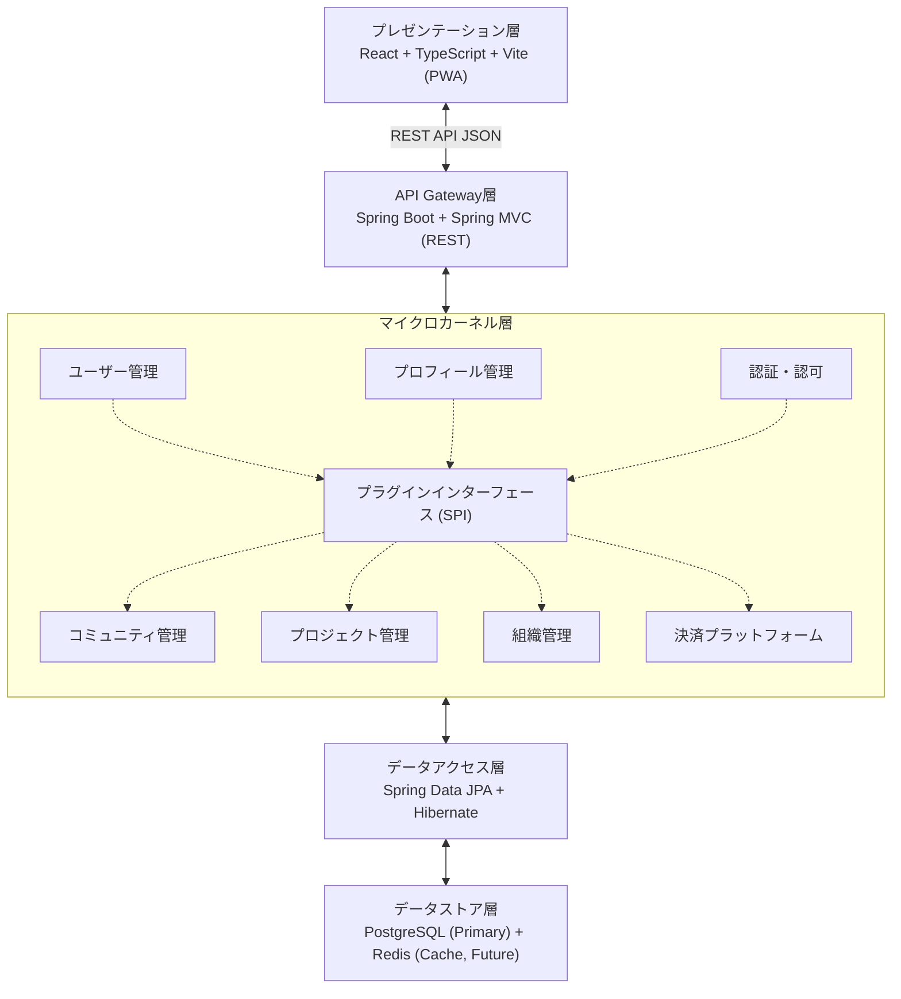

### 1.2 主要な設計目標

| 目標 | 説明 | 実現方法 |
|-----|------|---------|
| **拡張性** | 新機能を柔軟に追加可能 | マイクロカーネル + プラグイン方式 |
| **保守性** | 変更の影響範囲を最小化 | レイヤー分離 + 責務の明確化 |
| **スケーラビリティ** | 負荷に応じた拡張 | ステートレス設計 + キャッシュ戦略 |
| **セキュリティ** | 堅牢な認証・認可 | JWT + Spring Security + RBAC |
| **テスタビリティ** | 高いテストカバレッジ | 依存性注入 + モック容易性 |
| **パフォーマンス** | 高速なレスポンス | 非同期処理 + キャッシュ + インデックス最適化 |

---

## 2. マイクロカーネルアーキテクチャ

### 2.1 マイクロカーネルの概念

**マイクロカーネルアーキテクチャ**は、システムを以下の2つに分離します：

1. **コアシステム（カーネル）**: 最小限の必須機能のみを提供
2. **プラグインモジュール**: 拡張機能を動的に追加可能

### 2.2 コアシステム（MVPフェーズ）

```java
net.hidearea.core/
├── domain/           // ドメインモデル
│   └── entity/
│       ├── User.java
│       ├── Profile.java
│       ├── UserProfile.java
│       └── ProfileProfileRelation.java  // 案C: 階層関連
├── repository/       // データアクセス
├── service/          // ビジネスロジック
├── security/         // 認証・認可
└── api/              // REST API
    └── v1/
        ├── controller/
        └── dto/
```

#### コア機能

| 機能 | 説明 | 責務 |
|-----|------|------|
| **ユーザー管理** | ユーザーの登録、認証、プロフィール管理 | User, UserRepository, UserService |
| **プロフィール管理** | プロフィールのCRUD、階層管理 | Profile, ProfileRepository, ProfileService |
| **認証・認可** | JWT認証、RBAC、権限チェック | SecurityConfig, JwtTokenProvider, AuthService |
| **ユーザー・プロフィール関連** | 多対多関連の管理 | UserProfile, UserProfileRepository |
| **プロフィール階層関連** | 親子関係の管理（案C） | ProfileProfileRelation, ProfileProfileRelationRepository |

### 2.3 プラグインインターフェース（SPI: Service Provider Interface）

将来的にプラグインを追加するためのインターフェース設計：

```java
// プラグインの共通インターフェース
public interface HideAreaPlugin {
    String getPluginId();
    String getPluginName();
    String getVersion();
    void initialize(PluginContext context);
    void shutdown();
}

// プラグインコンテキスト（コアシステムとの接続点）
public interface PluginContext {
    UserService getUserService();
    ProfileService getProfileService();
    EventPublisher getEventPublisher();
    // ... 他のコアサービス
}

// プラグインレジストリ
public interface PluginRegistry {
    void registerPlugin(HideAreaPlugin plugin);
    void unregisterPlugin(String pluginId);
    Optional<HideAreaPlugin> getPlugin(String pluginId);
    List<HideAreaPlugin> getAllPlugins();
}
```

### 2.4 将来のプラグインモジュール

| プラグイン | 説明 | 依存するコア機能 |
|----------|------|---------------|
| **コミュニティ** | コミュニティ作成、投稿、コメント | User, Profile |
| **プロジェクト管理** | タスク管理、ガントチャート | User, Profile, Community |
| **組織管理** | 組織階層、部署、役職 | User, Profile |
| **コラボレーション** | リアルタイムチャット、ビデオ会議 | User, Profile, Community |
| **決済プラットフォーム** | サブスクリプション、単発決済 | User, Profile |

---

## 3. レイヤードアーキテクチャ

### 3.1 レイヤー構成

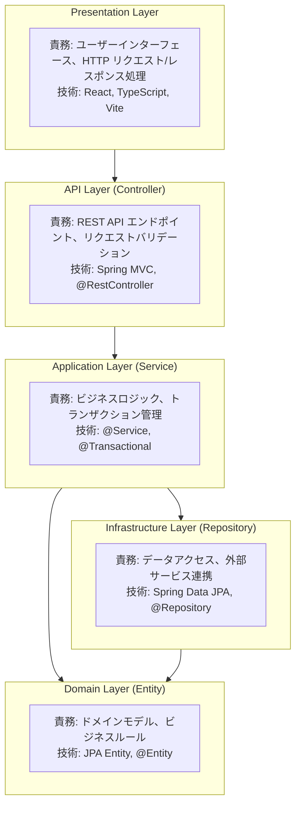

### 3.2 各レイヤーの責務と依存関係

| レイヤー | 責務 | 依存先 | 禁止事項 |
|---------|------|-------|---------|
| **Presentation** | UI、ユーザー操作の受付 | API Layer | ビジネスロジック、直接DB操作 |
| **API (Controller)** | REST API、バリデーション | Application Layer | 直接Repository呼び出し |
| **Application (Service)** | ビジネスロジック、トランザクション | Domain, Infrastructure | HTTPリクエスト/レスポンス処理 |
| **Domain (Entity)** | ドメインモデル | なし（純粋なモデル） | 外部依存、フレームワーク依存 |
| **Infrastructure (Repository)** | データアクセス | Domain | ビジネスロジック |

### 3.3 依存関係の原則

**依存性逆転の原則（DIP: Dependency Inversion Principle）**:
- 上位レイヤーは下位レイヤーに依存する
- 下位レイヤーは上位レイヤーに依存しない
- インターフェースを通じて疎結合を実現

```java
// 良い例: ServiceがRepositoryインターフェースに依存
public class ProfileService {
    private final ProfileRepository profileRepository;  // Interface

    public ProfileService(ProfileRepository profileRepository) {
        this.profileRepository = profileRepository;
    }
}

// 悪い例: Controllerが直接Repositoryを呼び出す（Serviceをスキップ）
// ❌ 避けるべき
public class ProfileController {
    private final ProfileRepository profileRepository;  // NG!
}
```

---

## 4. システム構成

### 4.1 開発環境構成

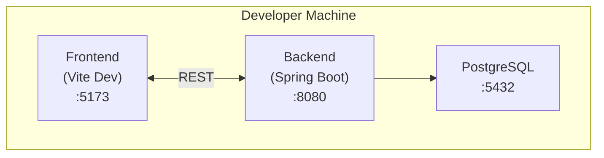

### 4.2 本番環境構成（Docker Compose）

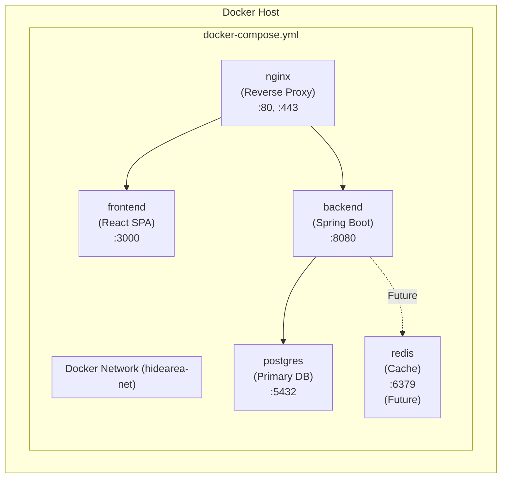

### 4.3 ネットワークフロー

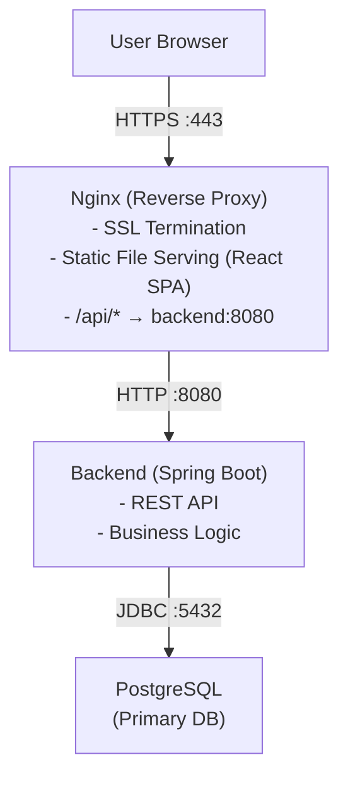

---

## 5. コンポーネント設計

### 5.1 バックエンドコンポーネント

#### 5.1.1 コアコンポーネント

```
net.hidearea.core/
├── domain/              // ドメイン層
│   ├── entity/          // JPA エンティティ
│   │   ├── User.java
│   │   ├── Profile.java
│   │   ├── UserProfile.java
│   │   └── ProfileProfileRelation.java
│   └── enums/           // Enum定義
│       ├── UserRole.java
│       ├── RoleInProfile.java
│       └── ProfileType.java
│
├── repository/          // インフラ層
│   ├── UserRepository.java
│   ├── ProfileRepository.java
│   ├── UserProfileRepository.java
│   └── ProfileProfileRelationRepository.java
│
├── service/             // アプリケーション層
│   ├── UserService.java
│   ├── ProfileService.java
│   ├── AuthService.java
│   └── impl/
│       ├── UserServiceImpl.java
│       ├── ProfileServiceImpl.java
│       └── AuthServiceImpl.java
│
├── security/            // セキュリティ層
│   ├── SecurityConfig.java
│   ├── JwtTokenProvider.java
│   ├── JwtAuthenticationFilter.java
│   └── CustomUserDetailsService.java
│
└── api/                 // API層
    └── v1/
        ├── controller/  // REST コントローラー
        │   ├── AuthController.java
        │   ├── UserController.java
        │   └── ProfileController.java
        ├── dto/         // データ転送オブジェクト
        │   ├── request/
        │   │   ├── LoginRequest.java
        │   │   ├── RegisterRequest.java
        │   │   └── CreateProfileRequest.java
        │   └── response/
        │       ├── LoginResponse.java
        │       ├── UserDto.java
        │       └── ProfileDto.java
        └── mapper/      // DTO ↔ Entity 変換
            ├── UserMapper.java
            └── ProfileMapper.java
```

#### 5.1.2 コンポーネント間の依存関係

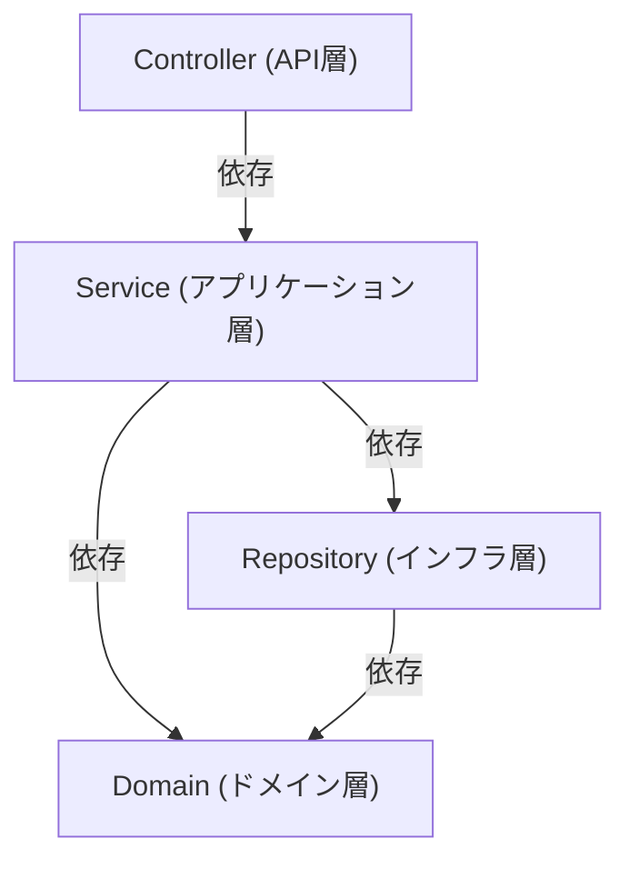

### 5.2 フロントエンドコンポーネント

```
frontend/
├── src/
│   ├── components/       // 共通コンポーネント
│   │   ├── common/       // 汎用UIコンポーネント
│   │   │   ├── Button.tsx
│   │   │   ├── Input.tsx
│   │   │   └── Modal.tsx
│   │   ├── layout/       // レイアウトコンポーネント
│   │   │   ├── Header.tsx
│   │   │   ├── Sidebar.tsx
│   │   │   └── Footer.tsx
│   │   └── features/     // 機能別コンポーネント
│   │       ├── auth/
│   │       │   ├── LoginForm.tsx
│   │       │   └── RegisterForm.tsx
│   │       └── profile/
│   │           ├── ProfileCard.tsx
│   │           ├── ProfileList.tsx
│   │           └── ProfileHierarchy.tsx
│   │
│   ├── services/         // API クライアント
│   │   └── v1/
│   │       ├── authService.ts
│   │       ├── userService.ts
│   │       └── profileService.ts
│   │
│   ├── types/            // TypeScript型定義
│   │   └── v1/
│   │       ├── User.ts
│   │       ├── Profile.ts
│   │       └── Auth.ts
│   │
│   ├── hooks/            // カスタムフック
│   │   ├── useAuth.ts
│   │   ├── useProfile.ts
│   │   └── useApi.ts
│   │
│   ├── stores/           // 状態管理（Zustand/Redux）
│   │   ├── authStore.ts
│   │   └── profileStore.ts
│   │
│   ├── pages/            // ページコンポーネント
│   │   ├── HomePage.tsx
│   │   ├── LoginPage.tsx
│   │   ├── RegisterPage.tsx
│   │   ├── ProfilePage.tsx
│   │   └── DashboardPage.tsx
│   │
│   └── utils/            // ユーティリティ
│       ├── api.ts        // Axios設定
│       ├── auth.ts       // 認証ヘルパー
│       └── validation.ts // バリデーション
```

---

## 6. データフロー

### 6.1 認証フロー（JWT）

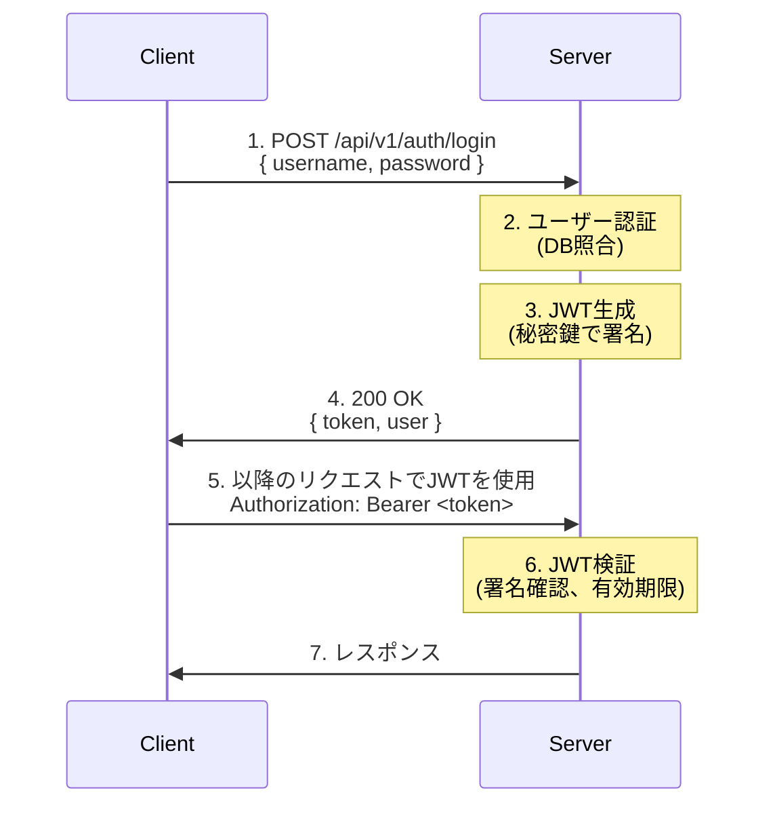

### 6.2 プロフィール作成フロー（案C）

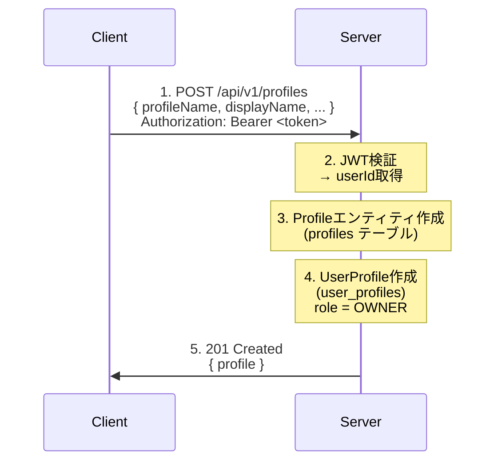

### 6.3 子プロフィール作成フロー（案C: 階層構造）

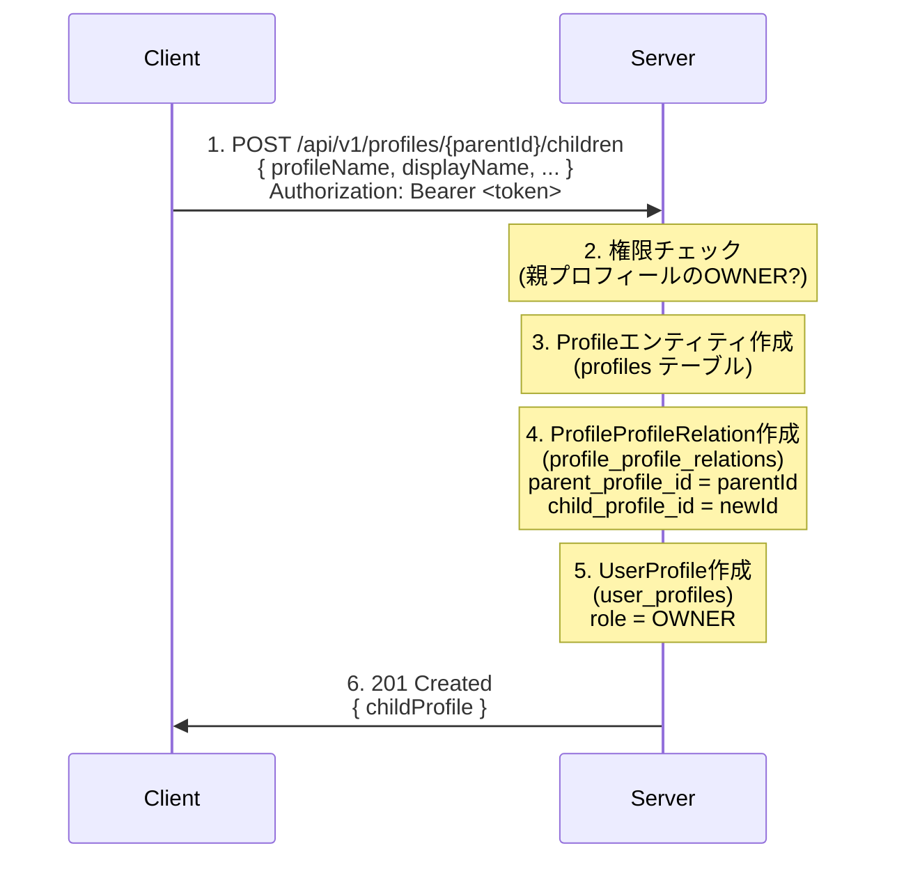

### 6.4 階層全取得フロー（再帰クエリ）

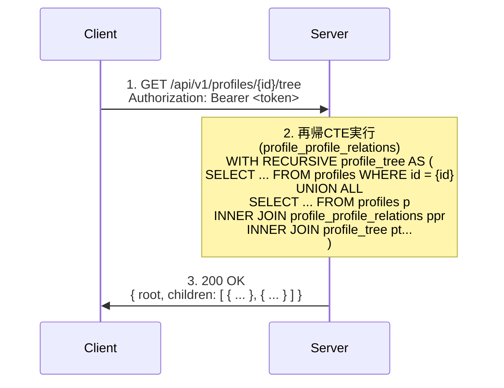

---

## 7. セキュリティアーキテクチャ

### 7.1 認証・認可の仕組み

#### 7.1.1 認証（Authentication）

**JWT（JSON Web Token）方式**:
- ステートレス認証（サーバー側でセッション不要）
- トークンに有効期限を設定（例: 24時間）
- リフレッシュトークン（将来対応）

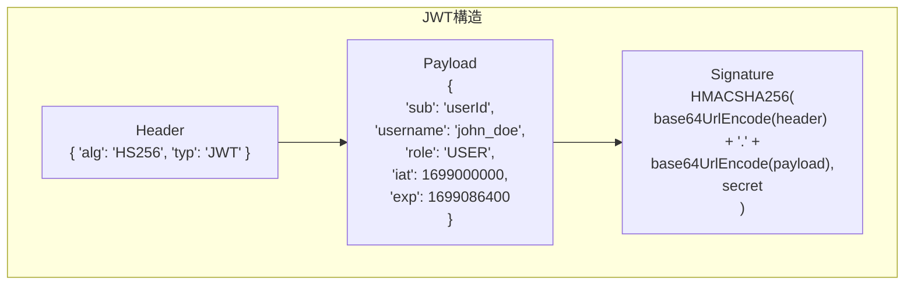

#### 7.1.2 認可（Authorization）

**RBAC（Role-Based Access Control）**:

| 役割 | レベル | 権限 |
|-----|-------|------|
| **USER** | システムレベル | 基本機能の利用 |
| **ADMIN** | システムレベル | 全ての機能、ユーザー管理 |
| **OWNER** | プロフィールレベル | プロフィールの完全な管理権限 |
| **MEMBER** | プロフィールレベル | プロフィールの閲覧、限定的な編集 |

**権限チェックの実装**:

```java
@RestController
@RequestMapping("/api/v1/profiles")
public class ProfileController {

    // システムレベルの権限チェック
    @GetMapping
    @PreAuthorize("hasRole('USER')")
    public List<ProfileDto> getProfiles() {
        // 実装
    }

    // プロフィールレベルの権限チェック（カスタム実装）
    @PutMapping("/{id}")
    public ProfileDto updateProfile(
        @PathVariable Long id,
        @RequestBody UpdateProfileRequest request,
        @AuthenticationPrincipal UserDetails userDetails
    ) {
        // Service層で権限チェック
        profileService.updateProfile(id, request, userDetails.getUsername());
    }
}
```

### 7.2 セキュリティ対策

| 脅威 | 対策 | 実装方法 |
|-----|------|---------|
| **SQLインジェクション** | パラメータ化クエリ | Spring Data JPA（自動対応） |
| **XSS** | 入力サニタイゼーション | React（自動エスケープ）、CSP |
| **CSRF** | CSRFトークン | SameSite Cookie（将来対応） |
| **認証情報漏洩** | パスワードハッシュ化 | BCrypt（強度10） |
| **中間者攻撃** | HTTPS強制 | Nginx SSL/TLS設定 |
| **権限昇格** | 厳密な権限チェック | @PreAuthorize、Service層チェック |
| **セッションハイジャック** | JWT有効期限 | 24時間有効期限 |
| **ブルートフォース攻撃** | レート制限 | Spring Security（将来対応） |

### 7.3 データ保護

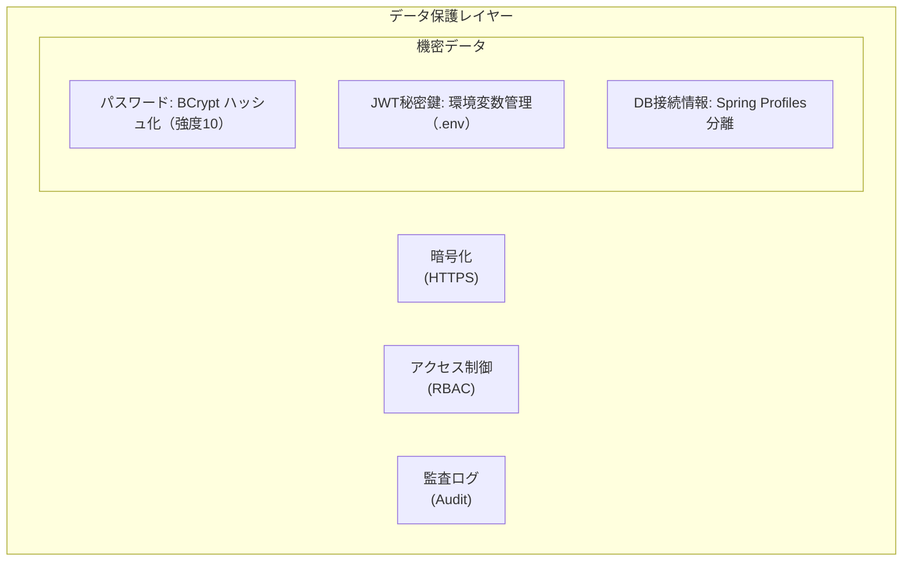

---

## 8. スケーラビリティ戦略

### 8.1 水平スケーリング

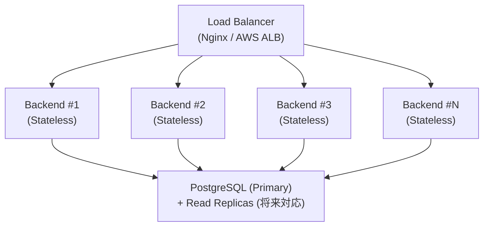

**ステートレス設計**:
- セッション情報をサーバー側で保持しない（JWT使用）
- 任意のバックエンドインスタンスで同じリクエストを処理可能
- スケールアウトが容易

### 8.2 キャッシュ戦略（将来対応）

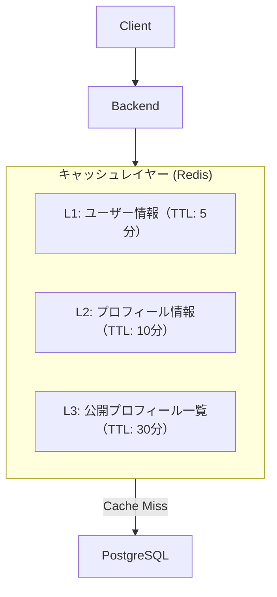

### 8.3 データベース最適化

| 戦略 | 説明 | 実装時期 |
|-----|------|---------|
| **インデックス最適化** | 頻繁に検索されるカラムにインデックス | MVP |
| **コネクションプール** | HikariCP（Spring Boot標準） | MVP |
| **N+1問題の回避** | JOIN FETCH、@EntityGraph | MVP |
| **Read Replica** | 読み取り専用レプリカ | 成長フェーズ |
| **パーティショニング** | 大量データの分割 | スケールフェーズ |
| **キャッシュ** | Redis導入 | 成長フェーズ |

---

## 9. デプロイメント戦略

### 9.1 環境構成

| 環境 | 用途 | インフラ |
|-----|------|---------|
| **開発環境 (dev)** | ローカル開発 | Docker Compose |
| **テスト環境 (test)** | CI/CD、自動テスト | Docker Compose |
| **本番環境 (prod)** | ユーザー向けサービス | Docker Compose / クラウド（将来） |

### 9.2 CI/CD パイプライン（将来対応）

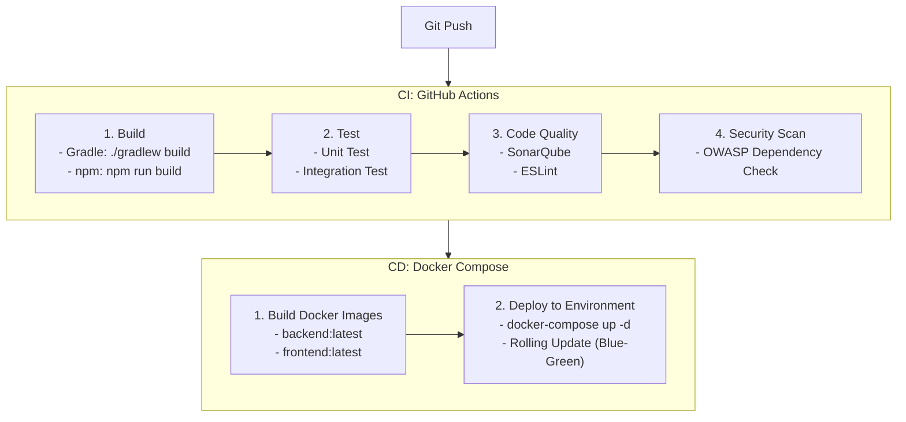

### 9.3 Docker コンテナ構成

```yaml
# docker-compose.yml (使用時は docker compose コマンドを使用)
version: '3.8'

services:
  postgres:
    image: postgres:15-alpine
    environment:
      POSTGRES_DB: hidearea
      POSTGRES_USER: hidearea
      POSTGRES_PASSWORD: ${DB_PASSWORD}
    volumes:
      - postgres-data:/var/lib/postgresql/data
    networks:
      - hidearea-net

  backend:
    build: ./backend
    environment:
      SPRING_PROFILES_ACTIVE: prod
      DATABASE_URL: jdbc:postgresql://postgres:5432/hidearea
      JWT_SECRET: ${JWT_SECRET}
    depends_on:
      - postgres
    networks:
      - hidearea-net

  frontend:
    build: ./frontend
    depends_on:
      - backend
    networks:
      - hidearea-net

  nginx:
    image: nginx:alpine
    ports:
      - "80:80"
      - "443:443"
    volumes:
      - ./nginx/nginx.conf:/etc/nginx/nginx.conf
      - ./nginx/ssl:/etc/nginx/ssl
    depends_on:
      - frontend
      - backend
    networks:
      - hidearea-net

volumes:
  postgres-data:

networks:
  hidearea-net:
    driver: bridge
```

---

## 10. アーキテクチャ設計原則

### 10.1 SOLID原則

| 原則 | 説明 | 実装例 |
|-----|------|-------|
| **S: 単一責任** | 1クラス = 1責務 | UserService（ユーザー管理のみ）、ProfileService（プロフィール管理のみ） |
| **O: 開放閉鎖** | 拡張に開かれ、修正に閉じる | プラグインインターフェース、Strategyパターン |
| **L: リスコフ置換** | 派生クラスは基底クラスと置換可能 | Service実装クラスがインターフェースを完全に実装 |
| **I: インターフェース分離** | 必要最小限のインターフェース | 大きなRepositoryを複数の小さなインターフェースに分割 |
| **D: 依存性逆転** | 抽象に依存、具象に依存しない | ServiceがRepositoryインターフェースに依存 |

### 10.2 設計パターン

| パターン | 用途 | 実装箇所 |
|---------|------|---------|
| **Repository** | データアクセスの抽象化 | ProfileRepository, UserRepository |
| **Service Layer** | ビジネスロジックの集約 | ProfileService, UserService |
| **DTO** | レイヤー間のデータ転送 | ProfileDto, UserDto |
| **Mapper** | Entity ↔ DTO 変換 | ProfileMapper, UserMapper |
| **Strategy** | アルゴリズムの切り替え | 認証方式（JWT, OAuth2将来対応） |
| **Factory** | オブジェクト生成の抽象化 | JwtTokenProvider |
| **Singleton** | 単一インスタンス | Spring Bean（デフォルト） |

### 10.3 設計指針

#### 10.3.1 疎結合（Loose Coupling）

```java
// 良い例: インターフェースに依存
public class ProfileService {
    private final ProfileRepository profileRepository;

    public ProfileService(ProfileRepository profileRepository) {
        this.profileRepository = profileRepository;
    }
}

// 悪い例: 具体的な実装に依存
public class ProfileService {
    private final ProfileRepositoryImpl profileRepository;  // NG!
}
```

#### 10.3.2 高凝集（High Cohesion）

```java
// 良い例: 関連する機能をまとめる
public class ProfileService {
    public ProfileDto createProfile(...) { ... }
    public ProfileDto updateProfile(...) { ... }
    public void deleteProfile(...) { ... }
    public ProfileDto getProfile(...) { ... }
}

// 悪い例: 無関係な機能が混在
public class MixedService {
    public ProfileDto createProfile(...) { ... }
    public UserDto createUser(...) { ... }  // 別のServiceに分離すべき
}
```

#### 10.3.3 DRY（Don't Repeat Yourself）

- 共通ロジックを抽象化
- ユーティリティクラス、ヘルパーメソッドの活用
- コード生成ツールの活用（Lombok, MapStruct）

#### 10.3.4 YAGNI（You Aren't Gonna Need It）

- 必要になるまで実装しない
- 過度な抽象化を避ける
- MVPフェーズでは必要最小限の機能に集中

---

## まとめ

本アーキテクチャ設計書は、HideAreaプラットフォームの技術的な基盤を定義します。

### 主要な設計決定

1. **マイクロカーネルアーキテクチャ**: 拡張性と保守性のバランス
2. **レイヤードアーキテクチャ**: 責務の明確化と依存関係の整理
3. **案C（明示的な2つの関連テーブル）**: 初学者の学習コスト削減
4. **JWT認証 + RBAC**: ステートレスで柔軟な認可
5. **Docker Compose**: 環境の一貫性と再現性

### 次のステップ

1. ✅ データ設計（DATA_DESIGN.md）
2. ✅ API仕様（API_SPECIFICATION.md）
3. ✅ パッケージ設計（PACKAGE_DESIGN.md）
4. 🔜 開発環境構築（ENVIRONMENT_SETUP.md）
5. 🔜 実装開始（MVPフェーズ）

---

**参考資料**:
- [マイクロカーネルアーキテクチャパターン](https://en.wikipedia.org/wiki/Microkernel)
- [Spring Boot Best Practices](https://spring.io/guides)
- [Clean Architecture](https://blog.cleancoder.com/uncle-bob/2012/08/13/the-clean-architecture.html)
