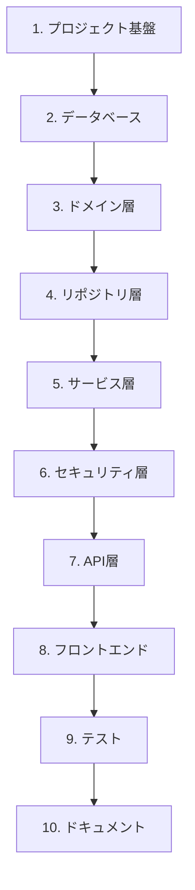

# クイックスタートガイド

**HideArea 開発者向けオンボーディングガイド**

このガイドは、HideAreaプロジェクトの開発を開始するための最短経路を示します。

---

## 目次

1. [はじめに](#1-はじめに)
2. [ドキュメントの読み方](#2-ドキュメントの読み方)
3. [環境構築](#3-環境構築)
4. [実装の進め方](#4-実装の進め方)
5. [よくある質問](#5-よくある質問)

---

## 1. はじめに

### 1.1 このプロジェクトについて

HideAreaは、マイクロカーネルアーキテクチャを採用したマルチデバイス対応Webサービスプラットフォームです。

**主な特徴**:
- Java 25 + Spring Boot 3.x (バックエンド)
- React 18 + TypeScript + Vite (フロントエンド)
- PostgreSQL 15+ (データベース)
- Docker Compose (開発環境)

### 1.2 MVPフェーズで実装する機能

現在のフェーズでは、以下のコア機能を実装します:

1. **ユーザー管理**: 登録、ログイン、JWT認証
2. **プロフィール管理**: CRUD操作、階層構造、メンバー管理

---

## 2. ドキュメントの読み方

### 2.1 推奨読書順序

#### ステップ1: 全体像の把握（30分）

```
1. README.md
   → プロジェクトの概要、技術スタック、主な機能

2. PROJECT_PLAN.md
   → プロジェクトの計画、フェーズ構成、開発方針
```

**目的**: プロジェクトが何を目指しているか、どのような技術で実現するかを理解する。

#### ステップ2: アーキテクチャの理解（1時間）

```
3. docs/architecture/ARCHITECTURE.md
   → システム全体のアーキテクチャ、レイヤー構成、コンポーネント設計
   ⭐ 最も重要: このドキュメントを最初に熟読してください

4. docs/DESIGN_DECISIONS.md
   → 重要な設計決定の記録と根拠（必読）
   ⭐ 設計の曖昧性を解消し、実装方針を明確化

5. docs/architecture/DATA_DESIGN.md
   → データベース設計、エンティティ、ER図、リポジトリパターン

6. docs/architecture/PACKAGE_DESIGN.md
   → パッケージ構造、APIバージョニング、命名規約
```

**目的**: システムの構造、設計決定、データモデル、コード配置ルールを理解する。

#### ステップ3: API仕様の確認（30分）

```
7. docs/api/API_SPECIFICATION.md
   → REST API仕様、エンドポイント一覧、リクエスト/レスポンス形式
```

**目的**: 実装するAPIの仕様を把握する。

#### ステップ4: 環境構築（1時間）

```
8. docs/development/ENVIRONMENT_SETUP.md
   → 開発環境のセットアップ手順、ツールのインストール

9. docs/development/DEVELOPMENT_GUIDE.md
   → 開発ワークフロー、コーディング規約、テスト方法
```

**目的**: ローカル開発環境を構築し、開発を開始できる状態にする。

#### ステップ5: 実装開始

```
10. docs/development/IMPLEMENTATION_CHECKLIST.md
    → MVPフェーズの実装チェックリスト、優先順位
```

**目的**: 実装すべき項目を順番に進める。

### 2.2 ドキュメント構成マップ

```
hidearea/
├── README.md                           # ⭐ 最初に読む: プロジェクト概要
├── PROJECT_PLAN.md                     # ⭐ 次に読む: プロジェクト計画
│
└── docs/
    ├── architecture/                   # アーキテクチャ設計書
    │   ├── ARCHITECTURE.md             # ⭐ 必読: システムアーキテクチャ
    │   ├── DATA_DESIGN.md              # データベース設計
    │   ├── PACKAGE_DESIGN.md           # パッケージ構造
    │   ├── TECH_STACK.md               # 技術スタック詳細
    │   └── REPOSITORY_DESIGN.md        # リポジトリ構成
    │
    ├── api/
    │   └── API_SPECIFICATION.md        # REST API仕様
    │
    └── development/                    # 開発ガイド
        ├── QUICK_START.md              # 本ドキュメント
        ├── ENVIRONMENT_SETUP.md        # 環境構築手順
        ├── DEVELOPMENT_GUIDE.md        # 開発ガイド
        └── IMPLEMENTATION_CHECKLIST.md # 実装チェックリスト
```

### 2.3 各ドキュメントの役割

| ドキュメント | 役割 | 読むタイミング |
|------------|------|--------------|
| **README.md** | プロジェクト概要 | 最初 |
| **PROJECT_PLAN.md** | プロジェクト計画 | 最初 |
| **ARCHITECTURE.md** | システムアーキテクチャ | 実装前（必読） |
| **DATA_DESIGN.md** | データベース設計 | エンティティ実装時 |
| **PACKAGE_DESIGN.md** | パッケージ構造 | コード作成時 |
| **API_SPECIFICATION.md** | API仕様 | Controller実装時 |
| **ENVIRONMENT_SETUP.md** | 環境構築 | 開発開始前 |
| **DEVELOPMENT_GUIDE.md** | 開発ワークフロー | 日常的に参照 |
| **IMPLEMENTATION_CHECKLIST.md** | 実装チェックリスト | 実装中（常時） |

---

## 3. 環境構築

### 3.1 前提条件

以下のツールをインストールしてください:

- **Java 25** (OpenJDK)
- **Node.js 20.x LTS** (npm含む)
- **Docker Desktop** (Docker Compose含む)
- **Git**
- **IDE**: IntelliJ IDEA / VS Code

### 3.2 環境構築手順（概要）

詳細は [ENVIRONMENT_SETUP.md](./ENVIRONMENT_SETUP.md) を参照してください。

#### ステップ1: リポジトリのクローン

```bash
git clone https://github.com/yourusername/hidearea.git
cd hidearea
```

#### ステップ2: 環境変数の設定

```bash
cp .env.example .env
# .envファイルを編集して必要な値を設定
```

#### ステップ3: バックエンドの起動

**開発環境（テストプロファイル - H2データベース使用）**:
```bash
cd backend

# Java 25 LTSを使用
# testプロファイルで起動（H2メモリデータベース）
./gradlew bootRun --args='--spring.profiles.active=test --server.port=9090'
```

**本番環境（PostgreSQL使用）**:
```bash
# PostgreSQLを起動
docker compose up -d postgres

# devプロファイルで起動
cd backend
./gradlew bootRun --args='--spring.profiles.active=dev'
```

**フロントエンドの起動（別ターミナル）**:
```bash
cd frontend
npm install
npm run dev
```

#### ステップ4: 動作確認

現在の状況（Phase 2完了時点）:
- ✅ バックエンドAPI: http://localhost:9090
- ✅ Health Check: http://localhost:9090/api/v1/health
- ✅ OpenAPI仕様: http://localhost:9090/v3/api-docs
- ⏳ Swagger UI: http://localhost:9090/swagger-ui.html（実装予定）
- ⏳ フロントエンド: http://localhost:5173（Phase 8で実装予定）

**動作確認コマンド**:
```bash
# ヘルスチェック
curl http://localhost:9090/api/v1/health

# OpenAPI仕様確認
curl http://localhost:9090/v3/api-docs | jq
```

---

## 4. 実装の進め方

### 4.1 実装の優先順位

MVPフェーズでは、以下の順序で実装を進めます:



### 4.2 フェーズ別実装ガイド

#### フェーズ1: プロジェクト基盤（1日）✅ **完了**

**目標**: プロジェクト構造を作成し、ビルドできる状態にする

**タスク**:
- [x] Spring Bootプロジェクト初期化（Gradle）
- [x] Reactプロジェクト初期化（Vite）
- [x] Docker Compose設定
- [x] 依存関係の追加
- [x] パッケージ構造の作成

**参考ドキュメント**: PACKAGE_DESIGN.md

**完了日**: 2025-11-05

#### フェーズ2: データベース（1日）✅ **完了**

**目標**: データベーススキーマを構築し、マイグレーションを実行

**タスク**:
- [x] Flyway設定
- [x] V1__init_schema.sql作成
- [x] ビルド・起動・APIテスト成功
  - Java 25 LTS使用
  - testプロファイルでH2データベース動作確認
  - `/api/v1/health` エンドポイントテスト成功
  - OpenAPI仕様（`/v3/api-docs`）取得成功

**参考ドキュメント**: DATA_DESIGN.md

**完了日**: 2025-11-06

**📝 注意**: V2__add_sample_data.sqlは必要に応じて後で追加します

#### フェーズ3: ドメイン層（2日）

**目標**: エンティティクラスとEnumを実装

**タスク**:
- [ ] User エンティティ
- [ ] Profile エンティティ
- [ ] UserProfile エンティティ
- [ ] ProfileProfileRelation エンティティ
- [ ] Enum定義（UserRole, ProfileType, RoleInProfile）

**参考ドキュメント**: DATA_DESIGN.md

#### フェーズ4: リポジトリ層（2日）

**目標**: データアクセス層を実装

**タスク**:
- [ ] UserRepository
- [ ] ProfileRepository
- [ ] UserProfileRepository
- [ ] ProfileProfileRelationRepository
- [ ] カスタムクエリの実装

**参考ドキュメント**: DATA_DESIGN.md

#### フェーズ5: サービス層（3日）

**目標**: ビジネスロジックを実装

**タスク**:
- [ ] AuthService（認証・認可）
- [ ] UserService（ユーザー管理）
- [ ] ProfileService（プロフィール管理）
- [ ] トランザクション管理
- [ ] 例外ハンドリング

**参考ドキュメント**: ARCHITECTURE.md

#### フェーズ6: セキュリティ層（2日）

**目標**: JWT認証とSpring Securityを実装

**タスク**:
- [ ] SecurityConfig
- [ ] JwtTokenProvider
- [ ] JwtAuthenticationFilter
- [ ] UserDetailsServiceImpl
- [ ] パスワードハッシュ化（BCrypt）

**参考ドキュメント**: ARCHITECTURE.md

#### フェーズ7: API層（3日）

**目標**: REST APIエンドポイントを実装

**タスク**:
- [ ] AuthController
- [ ] UserController
- [ ] ProfileController
- [ ] DTO（Request/Response）
- [ ] バリデーション

**参考ドキュメント**: API_SPECIFICATION.md

#### フェーズ8: フロントエンド（5日）

**目標**: React SPAを実装

**タスク**:
- [ ] ルーティング設定
- [ ] 認証フロー（Login/Register）
- [ ] プロフィール一覧・詳細・編集画面
- [ ] API通信（Axios）
- [ ] 状態管理（Context API/Zustand）

**参考ドキュメント**: PACKAGE_DESIGN.md

#### フェーズ9: テスト（3日）

**目標**: ユニットテスト・統合テストを実装

**タスク**:
- [ ] Repositoryテスト
- [ ] Serviceテスト
- [ ] Controllerテスト（MockMvc）
- [ ] フロントエンドテスト（Vitest）

**参考ドキュメント**: DEVELOPMENT_GUIDE.md

#### フェーズ10: ドキュメント・デプロイ（2日）

**目標**: ドキュメント整備とデプロイ準備

**タスク**:
- [ ] Swagger/OpenAPI設定
- [ ] README更新
- [ ] Docker本番環境設定
- [ ] CI/CD設定（GitHub Actions）

**参考ドキュメント**: ARCHITECTURE.md

### 4.3 推奨開発フロー

各機能を実装する際は、以下の順序で進めることを推奨します:

```
1. ドメイン層（Entity）の実装
   ↓
2. リポジトリ層（Repository）の実装
   ↓
3. サービス層（Service）の実装
   ↓
4. API層（Controller + DTO）の実装
   ↓
5. フロントエンド（React Component）の実装
   ↓
6. テスト実装
```

**理由**: 下位レイヤーから実装することで、依存関係のエラーを防ぎ、段階的にテストできます。

### 4.4 実装チェックリストの活用

実装の進捗管理には、[IMPLEMENTATION_CHECKLIST.md](./IMPLEMENTATION_CHECKLIST.md) を活用してください。

チェックリストには以下が含まれます:
- 実装すべき全タスク
- 優先順位
- 推定工数
- 依存関係

---

## 5. よくある質問

### Q1. どのドキュメントから読めばいいですか？

**A**: 以下の順序で読んでください:

1. README.md（5分）
2. PROJECT_PLAN.md（10分）
3. **ARCHITECTURE.md（30分）** ← 最重要
4. DATA_DESIGN.md（20分）
5. ENVIRONMENT_SETUP.md（環境構築時）

### Q2. 実装の優先順位は？

**A**: 以下の順序で実装してください:

1. プロジェクト基盤（Spring Boot + React初期化）
2. データベース（Flyway + エンティティ）
3. バックエンド（Service → Controller）
4. フロントエンド（認証 → プロフィール）
5. テスト

詳細は [IMPLEMENTATION_CHECKLIST.md](./IMPLEMENTATION_CHECKLIST.md) を参照。

### Q3. アーキテクチャの設計方針は？

**A**: 以下の原則に基づいています:

- **マイクロカーネルアーキテクチャ**: コア機能 + プラグイン方式
- **レイヤードアーキテクチャ**: Presentation → API → Service → Domain → Infrastructure
- **案C採用**: プロフィール階層は明示的な中間テーブル（ProfileProfileRelation）で管理
- **APIバージョニング**: URLパスベース（/api/v1/, /api/v2/）

詳細は [ARCHITECTURE.md](../architecture/ARCHITECTURE.md) を参照。

### Q4. プロフィール階層とは？

**A**: プロフィールが別のプロフィールを親として持つ構造です。

**例**:
```
企業プロフィール
  ├─ ゆるキャラA
  ├─ ゆるキャラB
  └─ 公式アカウント
```

`ProfileProfileRelation`中間テーブルで管理します。

詳細は [DATA_DESIGN.md](../architecture/DATA_DESIGN.md) の「1.4 ProfileProfileRelation」を参照。

### Q5. APIバージョニングはどう実装しますか？

**A**: URLパスベース方式を採用しています。

```
/api/v1/auth/login
/api/v1/profiles
/api/v2/...（将来）
```

- **Controller と DTO のみバージョン管理**
- **Service, Repository, Domain は共通化**

詳細は [PACKAGE_DESIGN.md](../architecture/PACKAGE_DESIGN.md) の「2. APIバージョニング実装」を参照。

### Q6. テストはどう書けばいいですか？

**A**: 以下のテスト戦略を推奨します:

- **ユニットテスト**: Service層のビジネスロジック
- **統合テスト**: Repository層のデータアクセス
- **APIテスト**: Controller層のエンドポイント（MockMvc）
- **E2Eテスト**: フロントエンド（将来対応）

詳細は [DEVELOPMENT_GUIDE.md](./DEVELOPMENT_GUIDE.md) を参照。

### Q7. 開発中に困ったら？

**A**: 以下の順序で確認してください:

1. **本ドキュメント（QUICK_START.md）の「よくある質問」**
2. **該当するドキュメント**（例: データモデルならDATA_DESIGN.md）
3. **ARCHITECTURE.md**（アーキテクチャの原則を再確認）
4. **Issue / Discussion**（GitHubで質問）

### Q8. 推奨する開発ツールは？

**A**:

| 用途 | 推奨ツール |
|-----|----------|
| IDE（バックエンド） | IntelliJ IDEA Ultimate |
| IDE（フロントエンド） | VS Code |
| データベースクライアント | DBeaver / pgAdmin |
| APIテスト | Postman / Insomnia |
| Gitクライアント | Git CLI / GitKraken |
| ターミナル | iTerm2 / Windows Terminal |

### Q9. コーディング規約は？

**A**:

- **Java**: Google Java Style Guide準拠
- **TypeScript**: ESLint + Prettier
- **命名規約**: [PACKAGE_DESIGN.md](../architecture/PACKAGE_DESIGN.md) の「4.1 命名規約」を参照

### Q10. ブランチ戦略は？

**A**: Git Flowを簡略化したモデルを推奨します:

```
main（本番）
  ├─ develop（開発）
      ├─ feature/user-auth（機能ブランチ）
      ├─ feature/profile-crud
      └─ fix/login-bug（バグ修正）
```

詳細は [DEVELOPMENT_GUIDE.md](./DEVELOPMENT_GUIDE.md) を参照。

---

## 📊 現在の進捗状況

**最終更新**: 2025-11-12

### 完了フェーズ

| フェーズ | 状態 | 完了日 | 備考 |
|---------|------|--------|------|
| **Phase 1: プロジェクト基盤** | ✅ 完了 | 2025-11-05 | Spring Boot + React + Docker設定完了 |
| **Phase 2: データベース設定** | ✅ 完了 | 2025-11-06 | Flyway設定、ビルド・起動・APIテスト成功 |
| **Phase 3: ドメイン層** | ✅ 完了 | 2025-11-12 | 全エンティティ・Enum実装、JPA Auditing有効化完了 |
| **Phase 4: リポジトリ層** | ✅ 完了 | 2025-11-12 | 全リポジトリ実装、カスタムクエリ・再帰クエリ実装完了 |
| **Phase 5: サービス層** | ⏳ 次のタスク | - | ビジネスロジック実装予定 |

### 実装済み機能

- ✅ プロジェクト構造（バックエンド・フロントエンド）
- ✅ Gradle Kotlin DSL設定（Java 25 LTS）
- ✅ Docker Compose設定（PostgreSQL, Backend, Frontend）
- ✅ Flywayマイグレーション設定
- ✅ データベーススキーマ設計（users, profiles, user_profiles, profile_profile_relations）
- ✅ Spring Boot基本設定（JPA, Security, Flyway）
- ✅ API基盤（ヘルスチェックエンドポイント）
- ✅ OpenAPI/Swagger設定
- ✅ **ドメイン層実装完了**
  - ✅ Enum定義（UserRole, ProfileType, RoleInProfile）
  - ✅ User エンティティ（ユーザー認証アカウント）
  - ✅ Profile エンティティ（プロフィール管理）
  - ✅ UserProfile エンティティ（ユーザー・プロフィール関連）
  - ✅ ProfileProfileRelation エンティティ（プロフィール階層管理）
  - ✅ JPA Auditing有効化（自動タイムスタンプ管理）
- ✅ **リポジトリ層実装完了**
  - ✅ UserRepository（ユーザー検索、有効アカウント検索）
  - ✅ ProfileRepository（プロフィール検索、階層クエリ）
  - ✅ UserProfileRepository（ユーザー・プロフィール関連管理）
  - ✅ ProfileProfileRelationRepository（プロフィール階層管理）
  - ✅ カスタムクエリ実装（再帰クエリによる階層取得、深度計算）

### 動作確認済み

```bash
# ビルド
./gradlew clean build -x test
# ✅ BUILD SUCCESSFUL

# 起動
./gradlew bootRun --args='--spring.profiles.active=test --server.port=9090'
# ✅ アプリケーション起動成功

# APIテスト
curl http://localhost:9090/api/v1/health
# ✅ レスポンス: {"application":"HideArea Backend","status":"UP",...}
```

### 次の作業

**Phase 5: サービス層の実装**
1. AuthService（認証・認可処理）
2. UserService（ユーザー管理ビジネスロジック）
3. ProfileService（プロフィール管理ビジネスロジック）
4. トランザクション管理
5. 例外ハンドリング

詳細は [IMPLEMENTATION_CHECKLIST.md](./IMPLEMENTATION_CHECKLIST.md) を参照してください。

---

## 次のステップ

1. ✅ このドキュメント（QUICK_START.md）を読む
2. 📖 [ARCHITECTURE.md](../architecture/ARCHITECTURE.md) を熟読する
3. ✅ [ENVIRONMENT_SETUP.md](./ENVIRONMENT_SETUP.md) で環境構築
4. ✅ [IMPLEMENTATION_CHECKLIST.md](./IMPLEMENTATION_CHECKLIST.md) を確認
5. ✅ Phase 3完了！
6. ✅ Phase 4完了！
7. 💻 Phase 5の実装開始！

---

## 参考リンク

- [README.md](../../README.md) - プロジェクト概要
- [PROJECT_PLAN.md](../../PROJECT_PLAN.md) - プロジェクト計画
- [ARCHITECTURE.md](../architecture/ARCHITECTURE.md) - システムアーキテクチャ
- [DATA_DESIGN.md](../architecture/DATA_DESIGN.md) - データベース設計
- [PACKAGE_DESIGN.md](../architecture/PACKAGE_DESIGN.md) - パッケージ構造
- [API_SPECIFICATION.md](../api/API_SPECIFICATION.md) - API仕様
- [ENVIRONMENT_SETUP.md](./ENVIRONMENT_SETUP.md) - 環境構築
- [DEVELOPMENT_GUIDE.md](./DEVELOPMENT_GUIDE.md) - 開発ガイド
- [IMPLEMENTATION_CHECKLIST.md](./IMPLEMENTATION_CHECKLIST.md) - 実装チェックリスト

---

**HideArea開発チームへようこそ！**

このガイドが、スムーズな開発の手助けになれば幸いです。質問があれば、GitHubのIssueやDiscussionで気軽に聞いてください。
